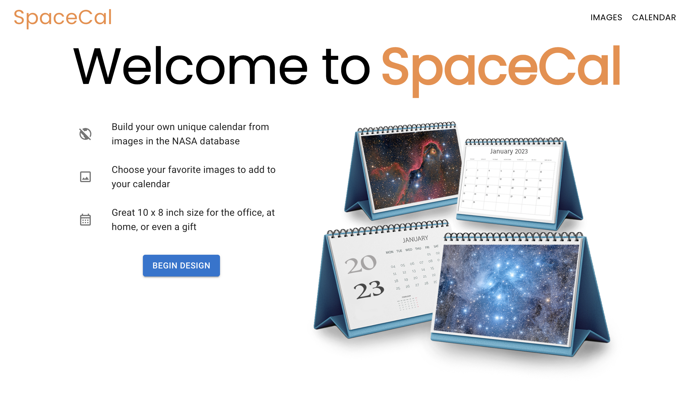
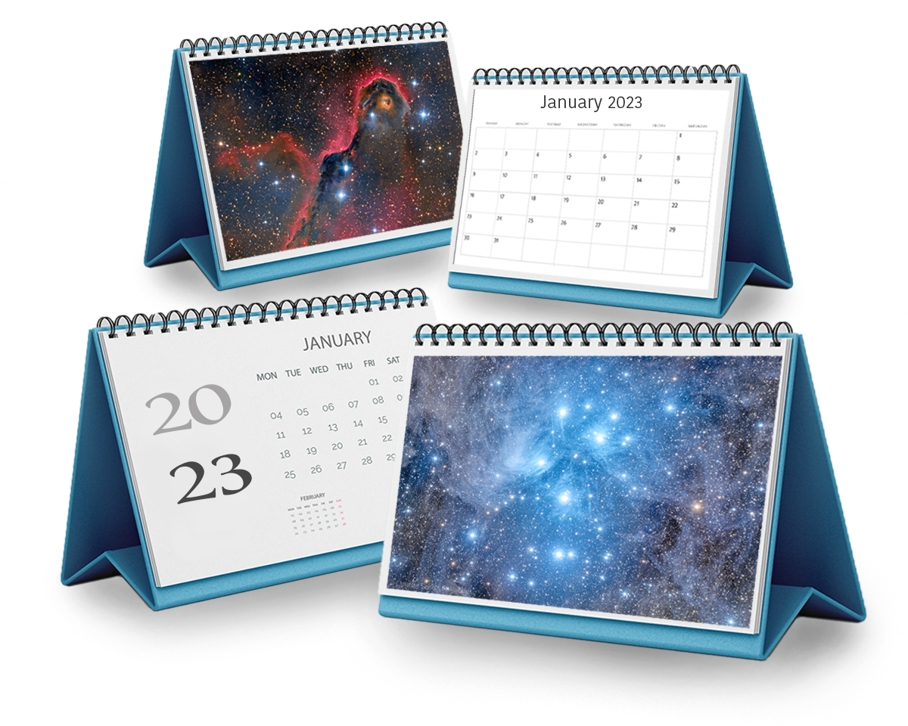

# SpaceCal



This application uses one of the NASA APIs to help the user build a desktop calendar. With NASA's database of images they use for "photo of the day", I was able to design and build a fully responsive and accessible application that helps the user search through images by date and allows them to add those photos to their calendar to later be printed. 

When I started designing this application, I designed it with the idea of using a different NASA API that I later found out is down and not functional. This was the Mars Weather API that had weather sensors on Mars. With the struggle of needing to completely change my idea and pivot to a new design, it was a blessing in disguise for my learnings of using Material UI. 

The SpaceCal application was built using React, TypeScript, and Material UI. This was my first time using this component library and it was very challenging at first to fully understand what the components were doing and how to implement them correctly. It felt just like learning a new language! It was very enjoyable and challenging at the same time. By the end of my MVP,  I feel confident that I can use Material UI and recongnize how to customize and develop new ideas with it. 

## Table of Contents

- [Authors](#authors)
- [Tech Stack](#tech-stack)
- [API Reference](#api-reference)
- [Application Previews](#application-previews)
- [Custom Image Design](#custom-image-design)
- [Running Tests](#running-tests)
- [Run Locally](#run-locally)
- [Deployment](#deployment)
- [Additional Resources](#additional-resources)
- [Future Additions](#future-additions)
 
## Authors

- [Ross Landino](https://www.github.com/mrlandino)


## Tech Stack

- **Languages and Libraries:** React, TypeScript, JavaScript, HTML, CSS, MaterialUI

- **Testing:** Cypress

- **Deployment:** Netlify

- **Accessibility:** Lighthouse


## API Reference
NASA API (APOD: Astronomy Picture of the Day)
```http 
  https://api.nasa.gov/index.html
```

#### GET single 'Photo of the Day'

```http
  GET https://api.nasa.gov/planetary/apod?api_key=DEMO_KEY&date=2023-01-19
```


## Application Previews

Home Page to Images Page


Images Page to Calendar Page


Responsive Design


## Custom Image Design

In building this application I was able to use some skills I learned in my previous career to photoshop an image to depict the calendars that the user is trying to buy.


## Running Tests

To run end-to-end tests, run the following command

```bash
  npm run cypress
```


## Run Locally

Clone the project

```bash
  https://github.com/mrlandino/life-on-mars
```

Go into the project directory

```bash
  cd life-on-mars
```

Install dependencies

```bash
  npm install
```

Start the server

```bash
  npm start
```


## Deployment

- 

## Additional Resources

- [Figma Wireframe](https://www.figma.com/file/5UoQYRj84lMnyGux9sd4GL/SpaceCal?node-id=0%3A1&t=8DCOWYAsmRUfZWkE-1)

- [Project Board](https://github.com/users/mrlandino/projects/3/views/1)


## Future Additions
- In the future I would love to allow the user to reorder the images on the calendar page so that they can fully custimze what image shows up on each month. 
- I would like to have dark mode and light mode for the entire application.
- Animations and other design aspects would help this application be more dynamic. 
